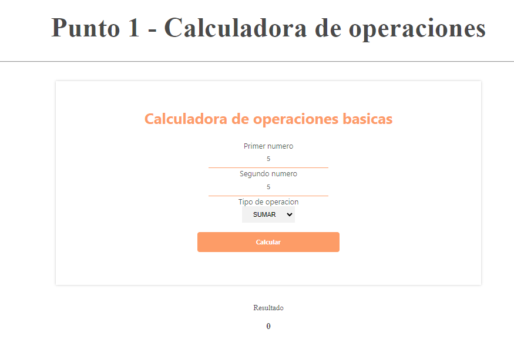
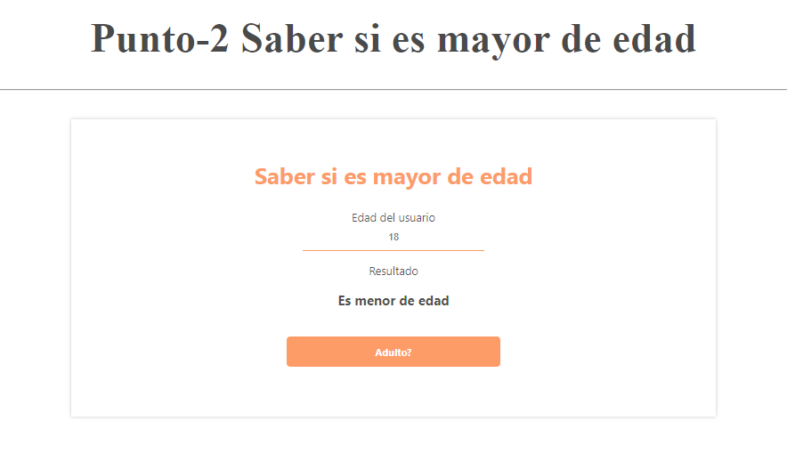
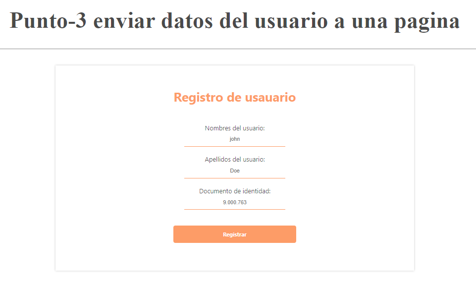
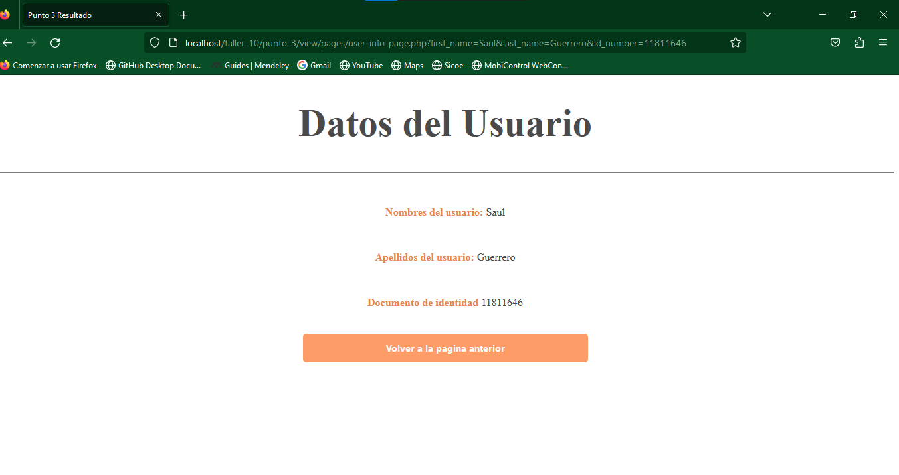
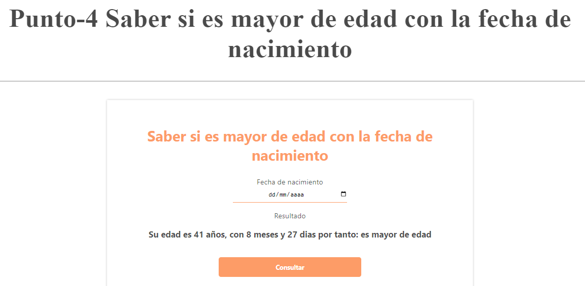
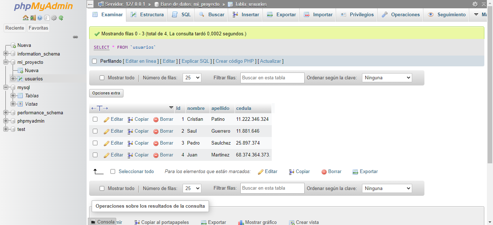
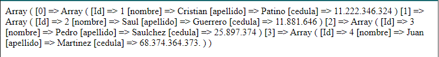
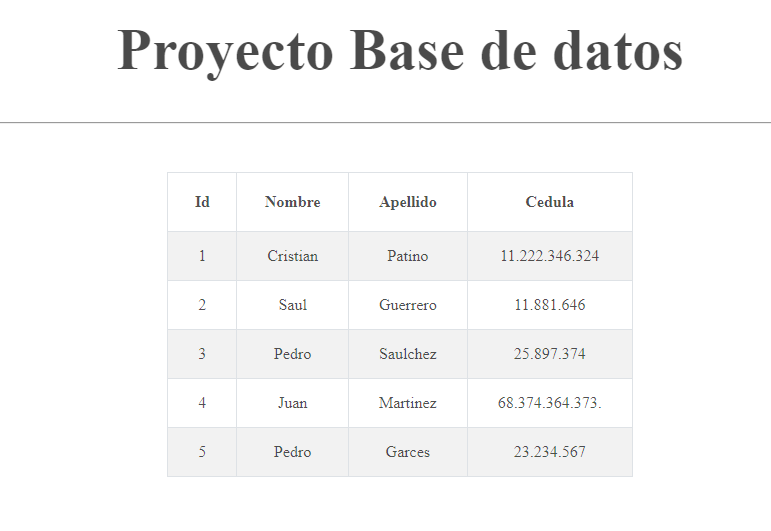

<h1>Taller 10: Saúl Guerrero</h1>

<h2>Información</h2>

Curso: Full Stack Basico - Grupo 1

Profesor: Cristian Patiño

Estudiante: Saúl Guerrero

<h2>Punto 1: Calculadora operaciones basicas</h2>

<h2>Punto 2: Saber si eres mayor de edad</h2>

<h2>Punto 3: Enviar datos del usuario a una pagina</h2>

<h2>Punto 4: Saber si es mayor de edad con la fecha de nacimiento</h2>

<h2>Punto 5-6-7: </h2>
<h3>5 - Base de datos </h3>

<h3>6 - Conexion Base de datos </h3>

<h3>7 - Muestra de datos en pantalla </h3>

